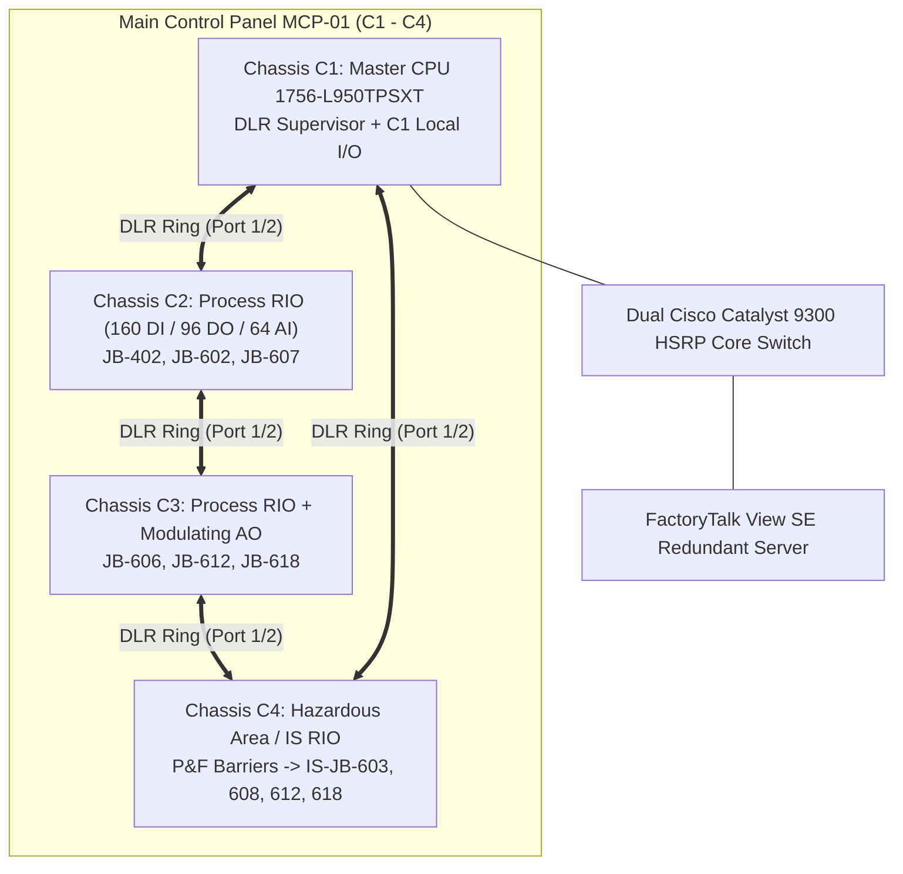

# FACTORY ACCEPTANCE TEST (FAT) — 1-DAY SITE VISIT AGENDA REPORT
## Ingredion Thailand — SPRINT 18K TPA Spray Dryer Plant (Kalasin)
### Focus Area: Main Control Panel (MCP-01) — ControlLogix 5580 Chassis C1, C2, C3, C4
**Document Ref**: `KAL-FAT-AGN-2608-C1C4` | **Revision**: `Rev 1.1 (Focus: C1–C4)`  
**Venue**: xDev Engineering Workshop (Integration & Testing Center)  
**Execution Concept**: High-Impact 1-Day Audited FAT & Interactive Site Visit  
**Target Hardware**: 4x Rockwell ControlLogix 1756 13-Slot Chassis (C1, C2, C3, C4 in MCP-01), Cisco Catalyst 9300 Redundant Core, Stratix 5700 DLR Ring, FactoryTalk View SE SCADA, Pepperl+Fuchs K-System IS Barriers

---

## 1. Executive Summary & C1–C4 FAT Architecture

### 1.1 The C1–C4 1-Day Site Visit Concept
The core brain of the **SPRINT 18K TPA Spray Dryer Plant** is housed in **Main Control Panel MCP-01**, consisting of **four 13-slot ControlLogix 1756 chassis (C1, C2, C3, and C4)** interconnected via a 100Mbps ODVA Device Level Ring (DLR) and dual Cisco Catalyst 9300 Core switches.

| Chassis ID | Role / Subsystem | Primary Hardware | I/O Count in C1–C4 | Destination Field Enclosures |
| :---: | :--- | :--- | :---: | :--- |
| **C1** | **Master Controller & Core I/O** | `1756-L950TPSXT` CPU, 3x `1756-EN4TR`, 4x DI, 2x DO, 2x AI | 128 DI, 64 DO, 32 AI | Central Area 1 (CA1), JB-401, JB-601 |
| **C2** | **Main Process RIO Chassis** | `1756-EN4TR` DLR Adapter, 5x DI, 3x DO, 4x AI | 160 DI, 96 DO, 64 AI | JB-402, JB-602, JB-607, CA1 |
| **C3** | **Extended Process & Analog Out** | `1756-EN4TR` DLR Adapter, 3x DI, 2x DO, 4x AI, 1x AO | 96 DI, 64 DO, 64 AI, 8 AO | JB-606, JB-612, JB-618, JB-402, JB-602 |
| **C4** | **Hazardous Area & IS Barriers** | `1756-EN4TR` DLR Adapter, 3x DI, 1x DO, 2x AI + P&F Barriers | 96 DI, 32 DO, 32 AI (All IS) | IS-JB-603, IS-JB-608, IS-JB-612, IS-JB-618 |
| **TOTAL** | **Chassis C1–C4 Combined** | **52 Slots (48 Populated / 4 Reserve)** | **480 DI, 256 DO, 192 AI, 8 AO (936 Total)** | **MCP-01 Local & Field JBs** |



---

## 2. Master FAT Timetable (Focus on C1–C4: 09:00 – 17:00)

| Time Window | Duration | Milestone / Agenda Item | Focus on Chassis C1–C4 Activities | Responsible | Location |
| :---: | :---: | :--- | :--- | :--- | :--- |
| **09:00 – 09:15** | 15 min | **Client Arrival & Welcome** | • Client reception & guest sign-in<br/>• Safety briefing & ESD protection check before entering MCP-01 bay | Safety Officer / Lead Host | Workshop Lobby / Conf A |
| **09:15 – 09:30** | **15 min** | **Detail on FAT (Kick-off)** | • **15-Min Briefing Focused on C1–C4**:<br/>  - 4-Chassis architecture & DLR ring topology<br/>  - Test criteria, Cat A vs B punch rules, sign-off workflow<br/>  - Distribution of C1–C4 slot drawings & test sheets | Project Manager / Lead Automation | Main Conference Room |
| **09:30 – 10:45** | 75 min | **Station 1: C1 & C2 Audit (Core PLC & Main Process)** | • **C1 Master CPU (Slot 0: 1756-L950TPSXT)**: Run mode status, firmware v34, memory & redundancy diagnostics<br/>• **Cisco 9300 & DLR Ring Test**: Unplug DLR Port 2 on C1S1; verify ring fault recovery in $< 3\text{ ms}$ with C2, C3, C4 staying online<br/>• **C1 & C2 DI Loop Simulation**: Toggle field dry contacts into 1756-IB32 (C1S4–S7 & C2S1–S5) via `TB-24VDC` rail; verify tag updates in Studio 5000<br/>• **C1 & C2 DO & Relay Test**: Force DO channels on 1756-OB32 (C1S8–S9 & C2S6–S8); verify `TBRL` relay coils `A1` and `TB-0VDC` return | Lead PLC Engineer / Client Inspector | Workshop Test Bay 1 (MCP-01: C1 & C2) |
| **10:45 – 12:00** | 75 min | **Station 2: C1 & C2 Analog Loops (4–20mA)** | • **C1 Analog Inputs (C1S10–S11)**: Fluke 789 5-point calibration (4, 8, 12, 16, 20mA) for Spray Dryer slurry feed & burner air flow<br/>• **C2 Analog Inputs (C2S9–S12)**: 64 AI channels audit; verify differential current loops (`IN-x` & `i RTN-x`) on 1756-IF16 cards<br/>• Verification of zero crosstalk, proper cable shield grounding, and scaling in Studio 5000 | Instrumentation Specialist / Client Rep | Workshop Test Bay 1 (MCP-01: C1 & C2) |
| **12:00 – 13:00** | 60 min | **Lunch Break & Discussion** | • Executive lunch & refreshments served in private dining room<br/>• Review morning C1/C2 test logs and prepare for C3/C4 afternoon testing | All Participants | Executive Dining Lounge |
| **13:00 – 14:15** | 75 min | **Station 3: C3 (Modulating AO) & C4 (P&F IS Barriers)** | • **Chassis C3 Extended Process**: DI (C3S1–S3), DO (C3S4–S5), AI (C3S6–S9)<br/>• **C3S12 Modulating AO (1756-OF8)**: Drive 4–20mA control valve setpoints; measure current output with precision DMM ($\pm 0.5\%$ tolerance)<br/>• **Chassis C4 Intrinsic Safety RIO**: Dedicated hazardous zone I/O (IS-JB-603, 608, 612, 618)<br/>• **Pepperl+Fuchs K-System Zener Barrier Audit**: Verify signal transmission integrity, galvanic isolation, and line fault detection (wire break) | Instrumentation & IS Specialist / Client Rep | Workshop Test Bay 2 (MCP-01: C3 & C4) |
| **14:15 – 15:00** | 45 min | **Station 4: SCADA Integration & Safety Trips** | • **FactoryTalk View SE SCADA**: Real-time HMI screens for C1–C4 tags, faceplates, alarms, and historical trends<br/>• **Safety Interlock Matrix**: Simulate high-temperature trip on C1/C2 AI; verify automatic burner shutdown and exhaust fan interlock<br/>• **Master Emergency Stop (E-Stop)**: De-energize safety relay; verify all DO outputs across C1–C4 drop to fail-safe state $< 50\text{ ms}$ | SCADA Software Lead / Client Process Eng | SCADA Control Station |
| **15:00 – 15:30** | **30 min** | **Coffee Break & Data Consolidation** | • Afternoon coffee break, artisan snacks, and fresh refreshments<br/>• Engineering team consolidates C1–C4 completed test sheets and prepares preliminary Punch List draft | All Participants (Eng team consolidates) | Hospitality Lounge / Office |
| **15:30 – 16:30** | 60 min | **Summary Meeting & Comments** | • Presentation of C1–C4 test results & overall pass rate ($100\%$ target)<br/>• Detailed review of Client Comments & Observations<br/>• Categorize findings: Category A (Must fix before dispatch) vs Category B (Site punch)<br/>• Assign action item owners, resolution due dates, and SAT alignment | PM, Lead Engineers & Client Delegation | Main Conference Room |
| **16:30 – 17:00** | 30 min | **FAT Protocol Sign-off & Departure** | • Formal endorsement & signing of FAT Certificate of Acceptance for MCP-01 (C1–C4)<br/>• Finalize packaging protection, crate shipping schedule, and client departure | Project Directors & Signatories | Main Conference Room |

---

## 3. C1–C4 Detailed Workstation & Testing Breakdown

### Station 1: Chassis C1 (Master CPU & DLR Supervisor)
- **Rack Configuration**: 13-Slot Chassis, Redundant Power Supplies
  - `Slot 0`: `1756-L950TPSXT` ControlLogix 5580 Processor (20MB memory, 1Gbps onboard port)
  - `Slots 1, 2, 3`: `1756-EN4TR` Ethernet/IP DLR communications modules
  - `Slots 4–7`: `1756-IB32` (128 DI channels) $\rightarrow$ Central Area CA1, Field JB-401, JB-601
  - `Slots 8–9`: `1756-OB32` (64 DO channels) $\rightarrow$ Interposing relays `TBRL1` & `TBRL2`
  - `Slots 10–11`: `1756-IF16` (32 AI channels) $\rightarrow$ Analog transmitters from JB-401 & JB-601
- **Key Test Actions**:
  1. CPU power-up, memory utilization check, firmware revision match.
  2. DLR Ring supervisor status on C1S1: Perform cable break test; verify zero I/O dropping.
  3. DI/DO loop sampling: Verify paired `TB-24VDC` (power) and `TB-0VDC` (return) wiring.

### Station 2: Chassis C2 (Main Process Remote I/O)
- **Rack Configuration**: 13-Slot Chassis
  - `Slot 0`: `1756-EN4TR` DLR Adapter
  - `Slots 1–5`: `1756-IB32` (160 DI channels) $\rightarrow$ Feed preparation, JB-402, JB-602, JB-607
  - `Slots 6–8`: `1756-OB32` (96 DO channels) $\rightarrow$ Solenoids and pump start/stop relays
  - `Slots 9–12`: `1756-IF16` (64 AI channels) $\rightarrow$ Chamber pressure, inlet air temp, scrubber flow
- **Key Test Actions**:
  1. 160 DI / 96 DO loop simulation on representative valves and motors.
  2. 64 AI channel verification: 5-point calibration and differential return (`i RTN-x`) integrity.

### Station 3: Chassis C3 (Extended Process & Modulating Valves)
- **Rack Configuration**: 13-Slot Chassis
  - `Slot 0`: `1756-EN4TR` DLR Adapter
  - `Slots 1–3`: `1756-IB32` (96 DI channels) $\rightarrow$ Exhaust bag filter & powder handling (JB-606, 612, 618)
  - `Slots 4–5`: `1756-OB32` (64 DO channels) $\rightarrow$ Pulse jet valve timers and discharge gates
  - `Slots 6–9`: `1756-IF16` (64 AI channels) $\rightarrow$ Differential pressure across filters & cyclone temp
  - `Slot 12`: `1756-OF8` (8 AO channels) $\rightarrow$ 4–20mA modulating steam and burner valves
- **Key Test Actions**:
  1. Modulating valve output simulation: 0%, 25%, 50%, 75%, 100% current output verification.
  2. Pulse jet filter timer logic and sequential pulsing verification.

### Station 4: Chassis C4 (Hazardous Area / Intrinsic Safety with Pepperl+Fuchs)
- **Rack Configuration**: 13-Slot Chassis with Dedicated IS Barrier Trunking
  - `Slot 0`: `1756-EN4TR` DLR Adapter
  - `Slots 1–3`: `1756-IB32` (96 IS DI channels) $\rightarrow$ Namur proximity switches via P&F barriers
  - `Slot 4`: `1756-OB32` (32 IS DO channels) $\rightarrow$ Ex-proof pilot solenoids via P&F galvanic isolators
  - `Slots 5–6`: `1756-IF16` (32 IS AI channels) $\rightarrow$ Hazardous area temperature and pressure loops
  - Target Field JBs: `IS-JB-603`, `IS-JB-608`, `IS-JB-612`, `IS-JB-618`
- **Key Test Actions**:
  1. Pepperl+Fuchs K-System Zener barrier impedance and signal transparency check.
  2. Line fault detection (LFD): Disconnect field wire; verify red LED illuminates on barrier and alarm triggers in PLC/SCADA.

---


---

## 4. Special Testing Methodology: Automated DI/DO Closed-Loop Cross-Wiring Simulation

### 4.1 Principle & Physical Circuit Architecture
To verify with 100% certainty that the wiring from the **PLC DO Module to the Relay Coil (A1/A2)**, the **Relay Dry Contact (11/14)**, the **Relay Return Line (TB-0VDC)**, and the **DI Field Terminal to the PLC DI Module** are completely sound, an **Automated Closed-Loop Cross-Wiring Routine** is deployed:

```text
┌──────────────────────────────────────────────────────────────────────────────────────────────────┐
│                    AUTOMATED DI / DO CLOSED-LOOP CROSS-WIRING SIMULATION                         │
├──────────────────────────────────────────────────────────────────────────────────────────────────┤
│                                                                                                  │
│  [PLC 1756-OB32 Output] ──(24VDC Out)──> [Relay Coil A1] ──> [Relay Coil A2] ──> [TB-0VDC Rail] │
│                                                │                                                 │
│                                      (Mechanical Pull-in)                                        │
│                                                ▼                                                 │
│  [TB-24VDC Rail] ────> [Relay Common 11] ───[NO Contact 14]                                      │
│                                                   │                                              │
│                                     (Temporary Loopback Jumper)                                  │
│                                                   ▼                                              │
│                                        [DI Terminal Strip (TBDI)]                                │
│                                                   │                                              │
│                                                   ▼                                              │
│                                        [PLC 1756-IB32 Input] ──(Sense = 1 within <200ms)         │
│                                                                                                  │
└──────────────────────────────────────────────────────────────────────────────────────────────────┘
```

### 4.2 Automated Test Execution Sequence
1. **Automated Command (Trigger)**:
   - The Python Automation Test Engine / Studio 5000 FAT Routine commands the target DO channel to Force ON (`DO = 1`).
2. **Hardware Relay Energization**:
   - The `1756-OB32` output pin fires +24VDC to Relay Coil terminal `A1`. The interposing relay coil energizes, pulling down the mechanical armature and closing the Normally Open (NO) dry contact terminals `11` and `14`.
3. **Loopback Feedback**:
   - Positive +24VDC from the `TB-24VDC` distribution rail passes through the closed dry contact `11/14`, traverses the temporary cross-wiring jumper, and enters the paired DI terminal block (`TBDI`).
4. **DI Input Sensing & Latency Validation**:
   - The corresponding `1756-IB32` digital input channel detects +24VDC and transitions from `0` to `1`.
   - The test engine senses this feedback bit transition, validates that response latency is within limit (Delta t < 200 ms), and marks the loop as **PASS**.
5. **De-energization & Contact Opening Check**:
   - The test engine forces `DO = 0`. The relay de-energizes, the contact opens, and the DI bit drops back to `0`, confirming no welded contacts or sticky relays.
6. **Autogenerated Report**:
   - The results (DO Tag, Relay Tag, DI Tag, Timestamp, Response Latency, and Verdict) are automatically logged into the master database and rendered into an official PDF/Excel report.

### 4.3 Why This Guarantees 100% Wiring & Hardware Health
- **Complete End-to-End Validation**: Validates all 4 critical wiring segments simultaneously:
  1. PLC DO card output terminal to Relay coil `A1`.
  2. Relay coil `A2` to `TB-0VDC` power return line.
  3. Relay internal mechanical switching and dry contact (`11/14`) continuity.
  4. DI Terminal block wiring to PLC DI input card terminal.
- **Zero Human Error & High Speed**: Eliminates manual probing and reading errors. Automatically tests all 256 DO channels across C1–C4 in under 5 minutes.
- **Auditable & Tamper-Proof**: Produces an autogenerated certificate with exact response millisecond latencies.

---

## 5. C1–C4 Pre-FAT Readiness Checklist (Internal Workshop Protocol)

Before the client arrives at 09:00, the following items on Chassis C1–C4 must be 100% verified:

- [x] **Chassis Power & Redundancy**: Dual 24VDC power supply rails to C1, C2, C3, C4 tested for seamless failover.
- [x] **DLR Ring Continuity**: All 4 EN4TR modules enrolled in ring; ring supervisor active on C1S1; ring status normal (Ring Closed).
- [x] **Studio 5000 I/O Tree**: All 48 populated modules show green health icons with zero communication faults.
- [x] **DO Terminal Cleaning**: Verified all 9 DO cards (`C1S8`, `C1S9`, `C2S6`, `C2S7`, `C2S8`, `C3S4`, `C3S5`, `C4S4`) contain strictly genuine 32 DO channels with zero spurious `RTN OUT` rows.
- [x] **Pepperl+Fuchs Barrier Pre-check**: All K-System modules seated firmly on DIN rail with power rail energized and fault bus monitored.
- [x] **Test Equipment Staged at MCP-01**:
  - 2x Fluke 789 ProcessMeter (calibrated).
  - 1x Digital Multimeter (Fluke 87V).
  - 1x DI Simulation Toggle Switch Box (16-CH).
  - 1x DO Pilot Lamp Indicator Box (16-CH).

---

## 6. Formal Endorsement & Acceptance Protocol (C1–C4 Focus)

```text
========================================================================================
         FACTORY ACCEPTANCE TEST (FAT) ENDORSEMENT — CHASSIS C1, C2, C3, C4
========================================================================================

Project:  Ingredion Kalasin — SPRINT 18K TPA Spray Dryer Plant
Scope:    Main Control Panel (MCP-01) — ControlLogix Chassis C1, C2, C3, C4
Document: KAL-FAT-AGN-2608-C1C4 / Rev 1.1

Result Summary:
[  ] CHASSIS C1–C4 ACCEPTED WITHOUT RESERVATION
[  ] CHASSIS C1–C4 ACCEPTED SUBJECT TO CLEARANCE OF CATEGORY B PUNCH LIST ITEMS
[  ] CHASSIS C1–C4 REJECTED (CATEGORY A DEFECTS REQUIRE RE-TESTING)


Representative of Client / Owner:            Representative of Kalasin Engineering:

Signature: __________________________        Signature: __________________________
Name:      __________________________        Name:      __________________________
Title:     __________________________        Title:     __________________________
Date:      ______ / ______ / 2026            Date:      ______ / ______ / 2026
========================================================================================
```
